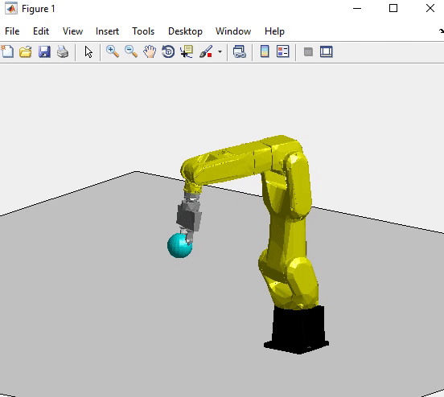

# Online Trajectory Generation
Online trajectory generation with bounded velocity and acceleration. Works for multiple direction case.

Dependency: Robotics Toolbox for MATLAB (Peter Corke) http://petercorke.com/wordpress/toolboxes/robotics-toolbox

## Instruction on running demo in MATLAB:

### Rename folder to `accOpt`

the folder structure should look like

    .
    ├── accOpt
    │   ├── acc_optimal
    │   ├── RobClass
    │   ├── Utils
    │   ├── judp.m
    │   ├── LICENSE
    │   └── README.md
### Add path

    >> addpath(genpath('./accOpt'));
    
### Construct robot object for visualization
    >> rob = RobVizLRMate;
    
###  Initialize visualization

    >> rob.InitPlot;
    
### Run trajectory generation simulation

determine maximum linear velocity `Vm`, maximum linear acceleration `Am`, and sampling time `dt`

    >> rob.anim( Vm, Am, dt );
    
e.g. Vm=1 m/s, Am=10 m/s^2, dt=1/30 s, use `rob.anim(1,10,1/30);`

then drag blue ball using mouse. The robot should try to reach the blue ball with Vm and Am in real time. Orientation will be determined automatically. 

    

### Terminate simulation by pressing the key `k` in the figure window

====

License: BSD (https://github.com/yzhao334/accOpt/blob/master/LICENSE)
